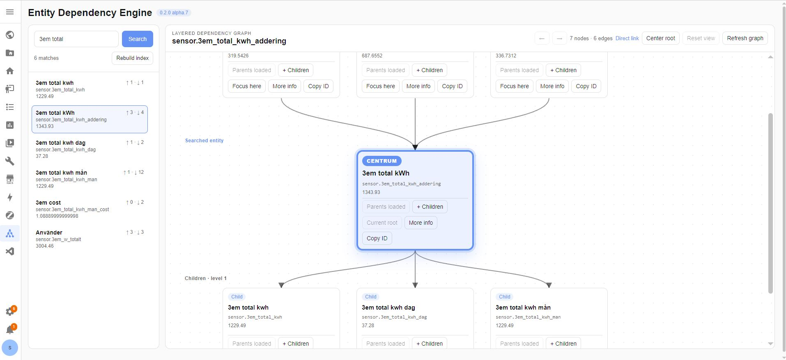
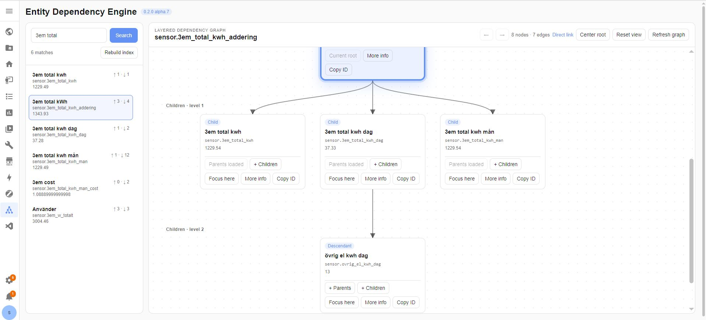
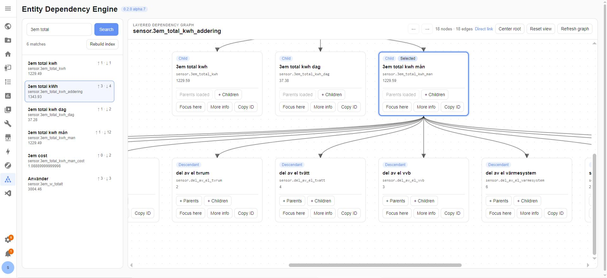
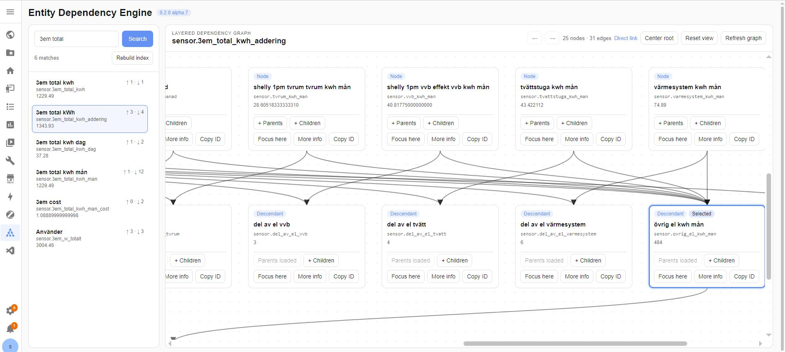

# Entity Dependency Engine

[](https://github.com/joakim79a/ha-entity-dependency-engine/actions/workflows/validate.yml)
[](https://github.com/joakim79a/ha-entity-dependency-engine/releases)
[](LICENSE)

Entity Dependency Engine is a read-only Home Assistant custom integration for exploring and reporting entity dependencies before you rename, disable, replace, or remove an entity.

> **Stable release:** `v0.2.0` adds the dependency explorer panel while preserving the v0.1.0 report workflow.

## Highlights

- Administrator-only Home Assistant sidebar panel
- Entity search with server-side filtering
- Vertical dependency graph with parents above and children below the root
- One-step parent and child expansion
- Navigation history, direct links, root centering, and view reset
- Cycle and broken-reference indicators
- Recursive reports in English or Swedish
- Backward-compatible report action and latest-report sensor
- Private report storage by default

## Screenshots







### Additional panel view



## Requirements

- Home Assistant `2026.6.0` or newer
- HACS for the recommended installation method
- An administrator account for the sidebar panel

## Installation with HACS

1. Open HACS.
2. Open **Custom repositories**.
3. Add `https://github.com/joakim79a/ha-entity-dependency-engine` as an **Integration**.
4. Search for **Entity Dependency Engine** and download it.
5. Restart Home Assistant.
6. Open **Settings > Devices & services > Add integration**.
7. Add **Entity Dependency Engine**.

Install the latest stable release through HACS.

## Sidebar panel

The panel lets administrators search entities, inspect a vertical dependency graph, expand branches, select nodes, use **Focus here**, navigate between previous roots, copy a direct URL, center the root, reset the view, and open Home Assistant's more-info dialog.

The panel is read-only and does not modify Home Assistant entities or configuration.

## Example script for dashboard-card

```yaml
sequence:
  - action: entity_dependency_engine.generate_report
    data:
      entity_id: "{{ target_entity }}"
      language: en
      include_structural: false
      save_public_copy: true
    response_variable: dependency_result
  - action: persistent_notification.create
    data:
      notification_id: entity_dependency_report
      title: "Entity Report: {{ target_entity }}"
      message: >-
        {{ dependency_result.summary }}

        Parents: {{ dependency_result.parents }} Children: {{
        dependency_result.children }} Ancestors: {{ dependency_result.ancestors
        }} Descendants: {{ dependency_result.descendants }}

        Broken references: {{ dependency_result.broken }} Build warnings: {{
        dependency_result.build_warnings }}

        [Open report]({{ dependency_result.url }})

        [Open debug report]({{ dependency_result.debug_url }})

        Generated: {{ dependency_result.generated }}
alias: "System: Analyze entity relationships (en)"
description: Builds the dependency graph for a selected entity and saves the report.
icon: mdi:file-tree
mode: single
fields:
  target_entity:
    name: Entity
    description: Select the entity whose relationships should be analyzed.
    required: true
    selector:
      entity: {}

```

## Example dashboard-card

```yaml
type: vertical-stack
cards:
  - show_name: true
    show_icon: true
    type: button
    name: Analyze entity
    icon: mdi:file-tree
    show_state: false
    tap_action:
      action: more-info
    hold_action:
      action: more-info
    entity: script.system_analysera_entitetsrelationer_duplicate
  - type: markdown
    title: Latest Entity Report
    content: |-
      

      
      ```text
      {{ report }}
      ```
      
      No report has been generated yet.

      Press **Analyze entity** above.
      
grid_options:
  columns: 9
  rows: auto
```

## Generate a report

```yaml
action: entity_dependency_engine.generate_report
data:
  entity_id: sensor.example
  language: en
  include_structural: false
  save_public_copy: false
response_variable: dependency_report
```

| Option | Description |
|---|---|
| `entity_id` | Entity to analyse |
| `language` | `en` or `sv` |
| `include_structural` | Include device and config-entry relations |
| `save_public_copy` | Also save files below `/config/www` |
| `max_depth` | Optional recursive depth limit |

The action also updates `sensor.entity_dependency_engine_last_report`.

## Report storage

Private reports:

```text
/config/entity_dependency_engine/reports/
```

Optional public copies:

```text
/config/www/entity_dependency_engine/
/local/entity_dependency_engine/
```

Public copies are disabled by default. Reports can contain sensitive names and configuration details.

## Compatibility with v0.1.0

Version v0.2.0 is designed as an additive upgrade. These remain compatible:

- `entity_dependency_engine.generate_report`
- `sensor.entity_dependency_engine_last_report`
- existing config entries, scripts, automations, and dashboards
- private and optional public report paths
- English and Swedish reports

No manual migration is expected. See [Upgrading](docs/UPGRADING.md).

## Languages

English is used for code, logs, GitHub documentation, and panel text. Swedish Home Assistant translations and Swedish reports are included.

## Issues and security

Read [CONTRIBUTING.md](CONTRIBUTING.md) before opening an issue and [SECURITY.md](SECURITY.md) before reporting a vulnerability. Remove private names, addresses, tokens, locations, and sensitive configuration from logs and screenshots.

## Support

[Buy me a coffee](https://buymeacoffee.com/joakim79a)

## License

MIT


